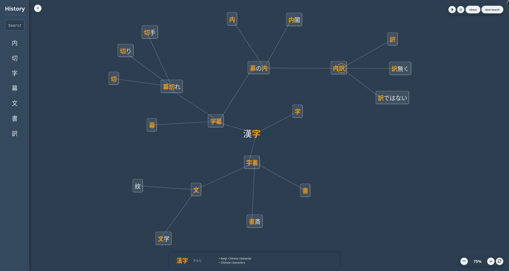

# Rinkuji

## What is Rinkuji?

Rinkuji (リンク字) is a web application designed to help you explore the intricate connections between Japanese words and the kanji they contain. By inputting a word, you can generate a dynamic, interactive graph that visually maps out the relationships between kanji, their components, and other related words.

Our goal is to provide a unique and intuitive learning tool for students of the Japanese language, making the process of understanding kanji and vocabulary more engaging and memorable.

## How to Use

1.  **Start a Search:** Upon visiting the homepage, if no word is specified, the "New Search" modal will appear automatically. Otherwise, click the "New Search" button in the top bar.
2.  **Enter a Word:** Type a Japanese word (in kanji or kana) or an English word into the search bar within the modal.
3.  **Generate Graph:** Press Enter or click the "Search" button. The graph will automatically generate, displaying connections between kanji, components, and related words.
4.  **Explore & Interact:** Click on individual kanji nodes to expand them. Pan and zoom the canvas to navigate. Right-click on nodes for more options, such as filtering content or collapsing branches.

## Features

*   **Interactive Kanji Relationship Graph**: Generates a dynamic, interactive graph visualizing connections between Japanese words, kanji, their components, and related words.
*   **Flexible Search**: Allows searching for Japanese words (kanji or kana) or English words.
*   **Node Interaction**: Users can click on individual kanji nodes to expand them, pan and zoom the canvas, and right-click for advanced options like filtering content or collapsing branches.
*   **Color Customization**: Users can customize background, highlight, and text colors via presets or custom pickers within the Options menu.
*   **Rerandomize Functionality**: Provides the ability to rerandomize content via the context menu.

## Data Source and Attribution

All dictionary and kanji data presented in Rinkuji is sourced directly from the [Jisho.org](https://jisho.org/) API. Jisho.org is a powerful Japanese-English dictionary that aggregates data from several projects. We are incredibly grateful to the Jisho.org team and the creators of these underlying data sources for making this information publicly available.

Specifically, Jisho.org utilizes data from the following open-source projects:
*   [JMdict](http://www.edrdg.org/jmdict/j_jmdict.html): A comprehensive general dictionary, property of the Electronic Dictionary Research and Development Group (EDRDG), used under their license.</li>
*   [Kanjidic2](http://www.edrdg.org/wiki/index.php/KANJIDIC_Project): A kanji database including readings, meanings, and metadata, also property of EDRDG and used under their license.</li>
*   [Tatoeba Project](https://tatoeba.org/): Provides most example sentences, licensed under Creative Commons CC-BY.</li>
*   [KanjiVG](https://kanjivg.tagaini.net/): Provides stroke order data for kanji, copyright © 2009-2012 Ulrich Apel and released under the Creative Commons Attribution-Share Alike 3.0 license.</li>
*   [JMnedict](https://www.edrdg.org/jmdict/j_jmdict.html): A database of Japanese proper names, property of EDRDG and used under their license.</li>
*   [RADKFILE](https://www.edrdg.org/wiki/index.php/RADKFILE_Project): A database of kanji radicals, property of EDRDG and used under their license.</li>
*   [Jreibun Project](https://jreibun.com/): Provides high-quality example sentences.</li>
*   [DBpedia](https://dbpedia.org/): Provides Wikipedia articles, dual licensed under Creative Commons Attribution-ShareAlike 3.0 and GNU Free Documentation License.</li>
*   [Jonathan Waller's JLPT Resources page](https://www.jlpt.jp/e/): Provides JLPT level information.</li>
*   [WaniKani audio](https://www.wanikani.com/): Provides audio files.</li>
</ul>

## Acknowledgements

* This project is an unofficial continuation of the original [Suiren.io](https://www.tofugu.com/japanese-learning-resources-database/suiren-io/). 
* Special thanks to Oni Sensei for your invaluable guidance and inspiration.

## Deployment

Rinkuji is deployed on [Render.com](https://render.com/), a cloud platform that provides a simple way to host web applications. The backend is a Flask application, and the frontend is a static web application.

## License

This project is licensed under the GNU AGPLv3 License - see the [LICENSE](LICENSE) file for details.

## Future Enhancements

== soon ==
*   ~~Finalize the Frontend test (urgent)~~  
*   ~~**API Caching:** Introduce caching mechanisms in the backend for Jisho API calls to boost performance and minimize redundant requests.~~ (Implemented)
*   ~~DEPLOYED~~
*   **Design / Add Web icon**
*   ~~**Make it work on Mobile** (URGENT)~~
*   ~~**Increase test coverage**~~
*   **Filter out Kanji-less**~~
*   **Smooth Motion Animation**: Implement smoother motion animations for ***BEEEFIER*** PCs to enhance visual experience. ✨ AESTHETICZ ✨
*   **Node Rearrangement**: Further work on node rearrangement algorithms for better graph layouts.
*   **First-time User Tutorial**: Implement an interactive tutorial or "how to play" guide for new users.
*   **Advanced Search & Filtering:** Expand search capabilities with options like radical search, stroke count, and JLPT level filtering.

== not yet ==
*   **Sounds**: Integrate audio cues for interactions and pronunciations. ✨ AESTHETICZ ✨
*   **Save/Load Graphs:** Enable users to save their generated graphs and load them for future reference or sharing.
*   **Gamification Elements**: Add different game modes to make it more competitive.
*   ...